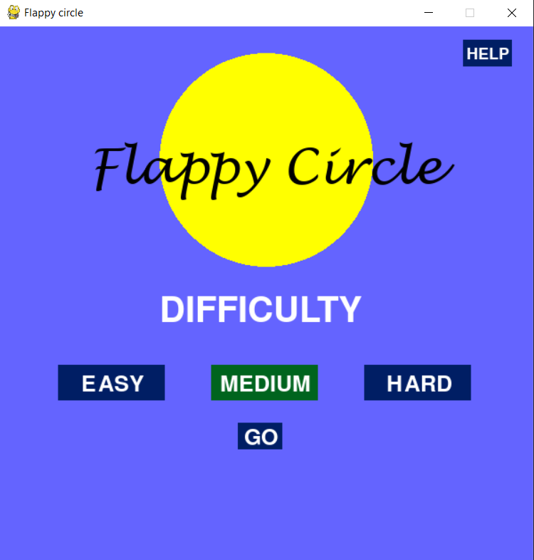
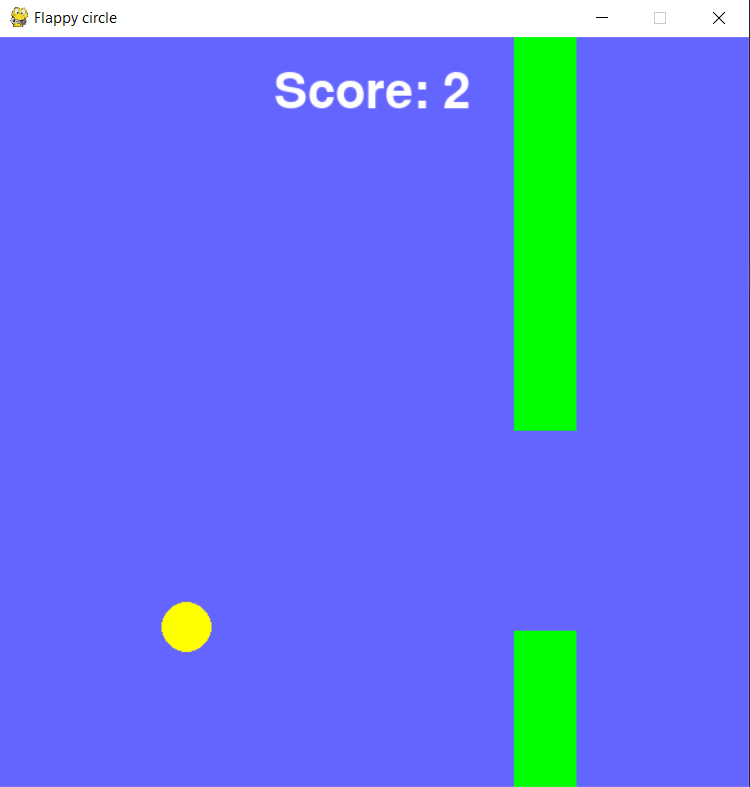
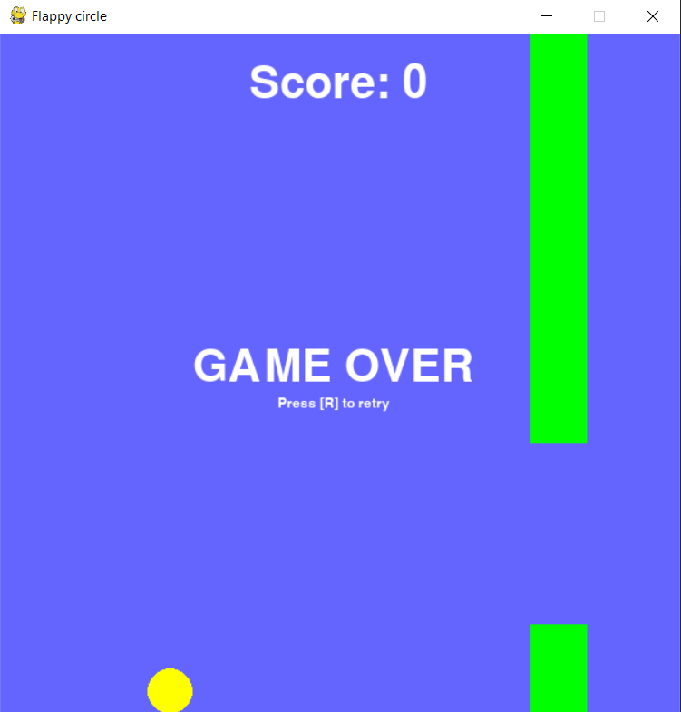

# flappy_circle

Basic flappy bird game but it's a circle instead of a bird. I included a difficulty selection stage so that users can customize their gameplay.
Also, I realised that I could use PySimpleGUI's popups in a pygame window, pretty cool.

Screenshot of the main start screen/difficulty selection screen

Screenshot of gameplay

Screenshot of gameover screen

